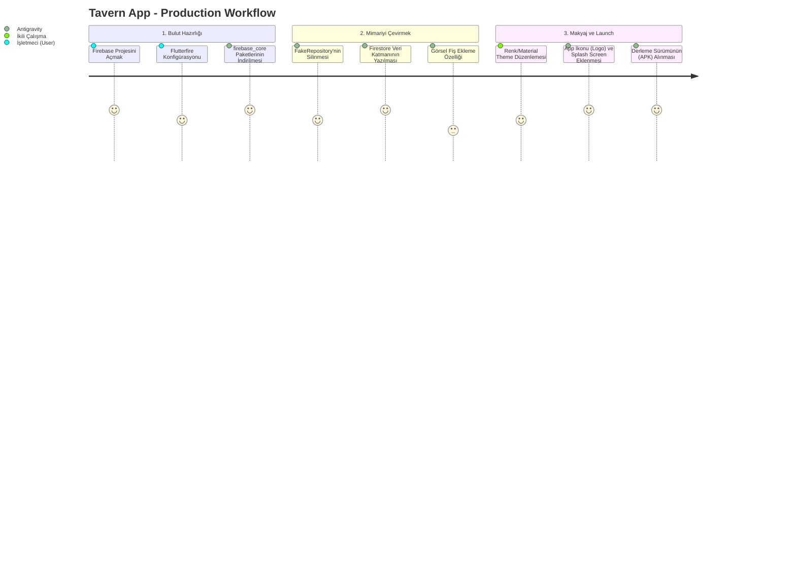

# Tavern App - Gelecek Yol Haritası ve İş Akışı (Roadmap)

Şu an itibarıyla projenin "çekirdek mimarisini" (State Management, UI Componentleri, Mantık Algoritmaları) başarıyla kurduk ve uygulama yerel (offline) bir ortamda kapalı uçlu bir ERP (Kurumsal Kaynak Planlama) sistemi gibi kusursuz çalışıyor.

Ciddi bir "Yazılım Mühendisliği Tasarım (Engineering Design)" projesi olarak buradan sonra atılması gereken adımların tam listesi ve iş akışı aşağıdadır.

---

## 1. Veritabanı ve Bulut Mimarisi (Backend & Firebase)
Projenin bir sonraki (ve en kritik) mantıksal aşaması, yazdığımız kodları internete bağlamaktır.

- **[ ] Firebase Console Kurulumu:** Projenin gerçek sahibi (mekan maili) üzerinden Google Firebase hesabı açılıp uygulamanın `google-services.json` lisansına bağlanması.
- **[ ] Cloud Firestore Entegrasyonu:** Şu an yazdığım `FakePersonnelRepository` sınıflarının kodunu değiştirip, verilerin bulut sunucuya kalıcı olarak (Real-time) okunup yazılması için `FirebasePersonnelRepository` sınıfına dönüştürülmesi.
- **[ ] Arşiv (History) Veritabanı Dizaynı:** Gün sonu düğmesine (Kayıt) tıklandığında, eski kasanın yok olmak yerine Firebase içerisinde "Kasim_Ayi_Tutanaklar" gibi bir ağacın altına arşiv olarak kopyalanması.

## 2. Kullanıcı Deneyimi ve Tema (UI / UX Polishing)
En başta söylediğin "Tema işini projenin en sonunda tekrar bakacağız" sözüne dönme vakti gelecek.

- **[ ] Renk Uzayı (Color Palette):** Tavern konseptine daha uygun gece/Dark Mode veya daha şık "meyhane" kültürü renklerinin sisteme Material Design kurallarıyla gömülmesi.
- **[ ] Font ve İkonografi:** Yazı tiplerinin (Roboto/Inter) değiştirilmesi, düğme köşelerinin (border radius) tasarımsal bütünlüğe kavuşması.
- **[ ] Animasyonlar:** Ekrana veri yüklenirken bekleten sıkıcı ikonlar yerine Lottie animasyonlarının veya mikro-etkileşimlerin eklenmesi.

## 3. Ekstra Özelliklerin İnşası (Feature Expansion)
Senaryoya göre uygulamanın kapasitesini genişletecek ince dokunuşlar:

- **[ ] Fiş / Fatura Görsel Ekleme (Storage):** Gider kalemlerine (örn. 1200 TL Mutfak Harcaması) ait fişin cep telefonu kamerasıyla fotoğrafının çekilip sisteme "Fatura Görseli" olarak Firebase Storage vasıtasıyla kaydettirilmesi. (Dokümanlarında istenen büyük bir özellik).
- **[ ] Personel Rol ve Yetkileri:** Aşçının sadece kendi hak edişini görebileceği giriş (Login) ekranı.
- **[ ] PDF Özeti Çıktısı:** Sene veya ay sonunda patrona verilmek üzere veresiye tablosunun tek tıkla Excel veya PDF'e dönüştürülmesi.

---

## Gelecek Entegrasyon İş Akışı (Future Workflow)

Aşağıdaki diyagram, kodlamaya tekrar başladığımızda sistemin parçalarının nasıl güncelleneceğini temsil eder. 

Tavern App altyapısı şu anda yukarıdaki adımların tamamını kaldırabilecek kadar modüler yazıldı! Hâlâ `tavern_app` dizininde kalıp devam etmemizi istersen, sıradaki durak **Firebase Entegrasyonudur.**
